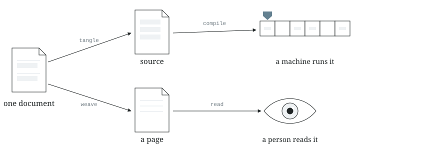
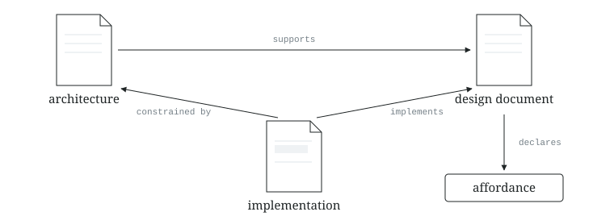
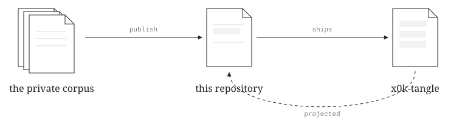

<!-- @generated by x0k-tangle (pipeline: identity-tangle) from corpora/x0k/publications/x0k-folio/x0k-folio.md — DO NOT EDIT. -->
<picture>
  <source media="(prefers-color-scheme: dark)" srcset="assets/diagrams/plate-dark.svg">
  
</picture>

Folio is a Markdown format and a set of tools for writing a program inside the
document that explains it. The code blocks in the document are where the code
lives; the source files are generated from them.

Here is a whole document, `docs/occlusion.md`:

````markdown
---
x0k:
  format: folio/v1
  id: x0k:implementation/occlusion
  type: implementation
  status: accepted
  tangle:
    root: src/occlusion.js
---
# Ambient occlusion

The visibility term is the mean of the samples the sampler returned.

```js {#average}
export function occlusion(samples) {
  return samples.reduce((a, b) => a + b, 0) / samples.length;
}
```

The type declarations are written here too, beside the function they
describe, and land in a file of their own:

```ts {#types file="src/occlusion.d.ts"}
export declare function occlusion(samples: number[]): number;
```
````

Then:

```sh
cargo run -p x0k-tangle -- tangle docs/occlusion.md --workspace .
```

**Tangling** is that step — collecting a document's code blocks into source
files. It writes `src/occlusion.js` and `src/occlusion.d.ts`, each opening
with a `@generated` header in that file's own comment style, plus a
`docs/occlusion.tangle-map.json` sidecar recording which chunk produced which
file.

One document, two files, two languages. The declarations and the code they
declare cannot fall out of step, because there is one place to edit them and
the other file is output. If you keep hand-written `.d.ts` files beside your
`.js` and watch them drift, that is what this is for; nothing about it is
specific to TypeScript, and nothing about it is specific to Rust either — the
tools are Rust, the documents are whatever you write.

Chunks also splice: a line reading `<<average>>` inside another block pastes
the `average` block in there, at the reference's own indentation. So you choose
the order that explains the program, and the compiler still receives the order
it needs.
**Weaving** is the other direction — the same document rendered as a page to
read.

<picture>
  <source media="(prefers-color-scheme: dark)" srcset="assets/diagrams/derive-dark.svg">
  
</picture>

Commit the document, the sidecar and the generated files together, and have CI
re-tangle and fail if the tree changes. That check is the whole reason the
prose stays true to the code; without it you have comments again.

[guides/INTEGRATING.md](guides/INTEGRATING.md) is the longer route: the same
example for a Rust crate, how to point a document at code you have already
written instead of rewriting it, and — in a section of its own — what these
tools do not do yet.

## Typed documents

Each document has a small YAML header that gives it an identity, a kind,
and named relationships to other documents. An implementation can name the
design it follows; a design can name the decision that supports it. The
checker validates this metadata against the vocabulary you select.

The supplied vocabulary describes documents, software, and their
relationships. You can extend it, replace it, or define a vocabulary
inside your documents.

For example, an **affordance** is one concept in the supplied vocabulary:
it describes something a person or tool can do.

<picture>
  <source media="(prefers-color-scheme: dark)" srcset="assets/diagrams/triangle-dark.svg">
  
</picture>

## Concepts and instances

A concept names a kind of thing; an instance is a particular thing of that
kind. The supplied vocabulary’s [Affordance definition](crates/x0k-ontology/ontology/modules/software.ttl)
includes this Turtle declaration:

```turtle
@prefix x0k: <https://0k.computer/ontology#> .
@prefix owl: <http://www.w3.org/2002/07/owl#> .
@prefix rdfs: <http://www.w3.org/2000/01/rdf-schema#> .

x0k:Affordance a owl:Class ;
    rdfs:label "Affordance" ;
    rdfs:isDefinedBy <https://0k.computer/ontology/software> .
```

A document can carry definitions in a `turtle folio:ontology` block.
Folio does not require every collection to use the Affordance concept:
you can define the concepts your collection needs.

“Query the documents” is one instance of Affordance. Its design document
declares it in a `yaml x0k:affordance` block:

```yaml
id: x0k:affordance/query_the_documents
actors: [human, ai_agent]
edges:
  enabledBy:
    - x0k:software-module/x0k-folio-cli
    - x0k:software-module/x0k-folio-dialog
```

The heading names the affordance; the surrounding prose describes it.
Definitions and instances can share a document or live in separate
documents in the collection.

The **Query the documents** entry under [What you can do with this](#what-you-can-do-with-this)
is a rendered view of that instance. The repository renderer turns its
heading, description, declaration, and icon into a linked entry. Its
affordance page adds the available software and interface information.
The surface and theme determine the presentation; custom concepts without
a dedicated renderer receive a readable default.

A collection with a vocabulary of its own ships here:
[`crates/x0k-folio-cli/examples/papers/`](crates/x0k-folio-cli/examples/papers)
is three documents, one of which declares a `paper:` namespace and a `Paper`
class in a `turtle folio:ontology` block while the other two are papers citing
each other. Copy it to start your own.

[Explore the supplied vocabulary](assets/diagrams/vocabulary.svg).
The diagram is generated from the modules shipped here.

## Publications

A **publication** selects documents and code from a larger collection and
produces a standalone repository. It records their origins in
`PROVENANCE.json` and refuses dependencies on crates outside the selection.

This repository was produced that way. It includes the tool that produced it,
together with that tool's source documents. The generated Rust is committed,
so you can build a fresh clone with `cargo`. The documents in
`implementation/` generate the code in `crates/`. Setup and integration
guides live in `guides/`.

<picture>
  <source media="(prefers-color-scheme: dark)" srcset="assets/diagrams/circle-dark.svg">
  
</picture>

## Why now

An agent can read the explanation while changing the code it describes,
and help maintain both. The document gives the next person or agent a place
to recover the reasoning behind the program.

CI checks that generated files match the document's code blocks. The
explanation still needs a reader's judgment.

Folio builds on literate programming, typed document graphs, and tools for
publishing part of a repository. [Background and prior work](IMPLEMENTATION.md#lineage).

## What you can do with this

- <picture><source media="(prefers-color-scheme: dark)" srcset="assets/icons/tangle-source-from-a-document-dark.svg"></picture> **[Project source code out of a document](decisions/design/corpus/literate-programming/project-source-code-out-of-a-document.md)**

  <p>Collect a document's code blocks into source files a compiler can build.</p>

- <picture><source media="(prefers-color-scheme: dark)" srcset="assets/icons/weave-a-document-dark.svg"></picture> **[Read a document as the woven artifact](decisions/design/corpus/literate-programming/read-a-document-as-the-woven-artifact.md)**

  <p>Read the explanation and code together, with each reference to another code block a link to where that block is defined.</p>

- <picture><source media="(prefers-color-scheme: dark)" srcset="assets/icons/check-a-document-against-shipped-vocabulary-dark.svg"></picture> **[Check a document against its vocabulary](decisions/design/corpus/publish-a-region-as-a-repository/check-a-document-against-its-vocabulary.md)**

  <p>Find metadata and relationships that do not match the document vocabulary.</p>

- <picture><source media="(prefers-color-scheme: dark)" srcset="assets/icons/read-declared-affordances-dark.svg"></picture> **[Declare concepts and instances](decisions/design/corpus/publish-a-region-as-a-repository/declare-concepts-and-instances.md)**

  <p>Define a vocabulary in a document, then describe particular things with it.</p>

- <picture><source media="(prefers-color-scheme: dark)" srcset="assets/icons/query-the-documents-dark.svg"></picture> **[Query the documents](decisions/design/corpus/publish-a-region-as-a-repository/query-the-documents.md)**

  <p>Ask questions across a collection's concepts, instances, and relationships.</p>

- <picture><source media="(prefers-color-scheme: dark)" srcset="assets/icons/show-an-icon-on-a-surface-dark.svg"></picture> **[Show an icon on any surface](decisions/design/presentation/icon-profile/show-an-icon-on-any-surface.md)**

  <p>Draw the same icon for different surfaces, using the colors and file format each needs.</p>

- <picture><source media="(prefers-color-scheme: dark)" srcset="assets/icons/check-an-icon-against-the-profile-dark.svg"></picture> **[Check an icon against the profile](decisions/design/presentation/icon-profile/check-an-icon-against-the-profile.md)**

  <p>Check an icon's geometry and strokes against the shared drawing rules.</p>

## Try it

Ask an agent to assess where Folio would help in your project:

```
Read https://github.com/0k-dot-computer/x0k-folio, including AGENTS.md and
guides/INTEGRATING.md. Look at my project. Where would typed documents or code
generated from documents be useful? Name a specific place to start, show
a small example, and explain the cost of keeping it up to date.
```

To try it yourself, write the document above and run the tangle command under
it, or [add a header to one document you already have](guides/INTEGRATING.md)
and run `cargo run -p x0k-tangle -- check <your folder>` from this checkout.

## What is in this repository

Both the literate sources and their tangled `@generated` outputs are
committed, and that is a bootstrap requirement rather than redundancy: the
tangler that regenerates the code is itself a crate here, so a fresh clone has
no `x0k-tangle` until it builds one. The committed projections are what break
that circle. An integration test pins the pairing — a projected `.md` source
with no committed output is a projection failure.

Everything outside `overlay:` is regenerated wholesale from the corpus this
repository is projected from, so a hand edit to any other file is overwritten
on the next publish. The overlay is the declared exception: paths this public
side owns — currently `CONTRIBUTING.md`, under `guides/` — which re-projection preserves
exactly as found and which never flow back. The resolved list is recorded in
`PROVENANCE.json`, so both directions read the same policy.

## License

MIT — [`LICENSE-MIT`](LICENSE-MIT), Copyright (c) 2026 0k.computer. Single-license
on purpose, where most Rust crates carry the `MIT OR Apache-2.0` dual license:
this repository is a projection, and the license it is released under is
declared once, in the publication document it is projected from.

Dependencies keep their own terms — most are `MIT OR Apache-2.0`, `similar` is
Apache-2.0 only, and Dialog is MPL-2.0 from a pinned revision. MIT covers this
repository's code and does not replace them; keep their notices when you
distribute binaries. [The dependency licenses](IMPLEMENTATION.md#license), and
`cargo tree --format '{p} {l}'` for the resolved set.

[Implementation](IMPLEMENTATION.md) · [Integration](guides/INTEGRATING.md) ·
[Contributing](guides/CONTRIBUTING.md) · [MIT license](LICENSE-MIT)
