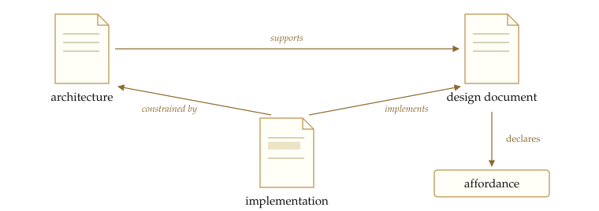
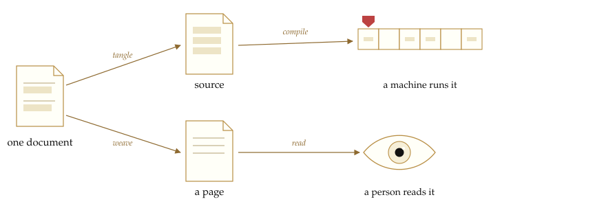
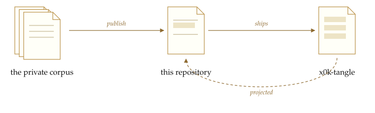

<!-- @generated by x0k-tangle (pipeline: identity-tangle) from decisions/publications/x0k-folio.md — DO NOT EDIT. -->
<picture>
  <source media="(prefers-color-scheme: dark)" srcset="docs/plate-dark.svg">
  
</picture>

Organizations run on documents that are not interchangeable: a decision,
specification, and design note each has a distinct role, lifecycle, and review
path. In a directory of Markdown none of that is written where a program can
read it: the
kind lives in a naming convention, the relationships live in people's heads, and
the code a design describes drifts away from it because they are two files and
nothing compares them.

A folio document writes it down. It is Markdown with a YAML envelope that gives
it an identity, names its kind and its stage in a lifecycle, and names its
relationships to other documents by predicate rather than by file path — this one
**supports** that one, that one is **refined_by** a third. Those predicates are
terms in an OWL vocabulary shipped beside the format, so a program checks them
instead of a team agreeing to remember them. That program ships here too.

<picture>
  <source media="(prefers-color-scheme: dark)" srcset="docs/triangle-dark.svg">
  
</picture>

Three things are derived from such a document. **Tangling** and **weaving** are
the same content in two orders — one a compiler can build, one a person can read.
**Publishing** is the third, and works on a region rather than a page: a
publication names a slice of a private **corpus** — some crates, some
vocabulary modules, some documents, even sections of documents — and writes it
out as a standalone repository, recording in `PROVENANCE.json` which corpus
revision it came from. Everything unnamed stays home, and a published crate
depending on an unpublished one fails the projection rather than leaking it.

<picture>
  <source media="(prefers-color-scheme: dark)" srcset="docs/derive-dark.svg">
  
</picture>

The source is ordinary Rust: it compiles and runs with `cargo`, with nothing of
x0k underneath it.

**This repository is that output.** The tangler that made it is one of the crates
it ships, tangled from documents it also ships. 0k.computer published a working
slice of itself, using itself.

<picture>
  <source media="(prefers-color-scheme: dark)" srcset="docs/circle-dark.svg">
  
</picture>

The generated code is committed beside the documents, which is what breaks the
bootstrap circle: a fresh clone has no `x0k-tangle` until it builds one.

None of these ideas is new. Tangling and weaving are Knuth's words from 1984, and
the shape here — named chunks, one document producing many files — is noweb's,
which Org-mode Babel and Entangled carry into editors and Markdown. That a
document is a typed node with typed edges, checked against a vocabulary rather
than a convention, is the Semantic Web's argument, made for wiki pages by
Semantic MediaWiki and for cross-references by Sphinx domains; the edge names are
borrowed from CiTO and PROV-O. Regenerating a public tree from a private one is
Copybara's practice, and it works.

The first two have a reputation for not working out, and they failed the same
way: both asked a person to write something only a machine would read. Under a
deadline you maintain the artifact that runs and let the prose rot, and strangers
never did agree on a vocabulary. That is the cost that changed. An agent writes
the prose and, more to the point, reads it — recovering intent from a document
far better than from code — so the explanation stops being a tax on shipping and
becomes the fastest way to hand the work on. It writes the envelope too, and acts
on a partial graph rather than needing a whole one, so an unfinished vocabulary
pays immediately instead of paying at the end or never. On top of that,
enforcement: CI re-derives every generated file on each run and fails if what is
committed is not byte-for-byte what the document says.

## Reading the implementation

What follows is the substrate chapter by chapter, grouped by what each document
is about rather than which crate its code ends up in. It is implementation
detail, and none of it is required reading: pointing an agent at this repository
is a first-class way in, and the typed envelopes and the shipped vocabulary are
much of what makes that work.

### What a document is

The envelope at the top, the identity it declares, and the block tree beneath it.

- [x0k-folio: the format library](knowledge/implementation/folio/format.md) — The crate root — its chapter map, and the one feature flag that severs the substrate-facing half so a standalone build is pure functions over strings.
- [The colophon: one envelope, one parser, one renderer](knowledge/implementation/folio/colophon.md) — The envelope's single parser and renderer, permissive about keys it does not own and closed about the keywords it does, consumed by every crate that touches a folio file.
- [Who a document says it is](knowledge/implementation/folio/identity.md) — The identity half of an x0k URI — class, slug, and the fragment that names a part of what the slug names — parsed and rendered by the format library itself, so a document can say who it is without a substrate underneath it.
- [The structural block tree](knowledge/implementation/folio/structural.md) — The parser-agnostic block tree both the markdown and the HTML sides parse into: syntactic, orthogonal to the editorial axis, and owned here so two renderer crates can share it without a dependency cycle.

### The vocabulary a document is written in

Where the terms an envelope uses come from, how they reach the code as tables, and what it means for a document to check against them.

- [Concepts Are Facts](knowledge/implementation/ontology/concept-facts.md) — Why the vocabulary lives as facts in the concept region rather than compiled from a schema file, and how the module files are materialized back out of it.
- [The vocabulary, parsed once, at build time](knowledge/implementation/ontology/module-bootstrap.md) — The build script that reads the checked vocabulary modules, refuses a set whose imports do not close, and emits the constant tables the crate root re-exports — so nothing at runtime carries a Turtle parser.
- [The crate root is a compatibility view](knowledge/implementation/ontology/views.md) — How the crate root turns whichever module set is present into the class, property, and edge-predicate tables other crates check a document against.
- [Checking a document against what shipped with it](knowledge/implementation/folio/checking.md) — Reading an envelope against the vocabulary the bundle actually ships — and keeping a missing term, which is a packaging defect, apart from a missing target, which is the boundary working.

### A document that reaches beyond itself

Inclusion by reference instead of copying, and entities authored inside prose and read back out of it.

- [Transclusion: include, don't copy](knowledge/implementation/folio/transclusion.md) — The shared resolution core for inclusion by reference — spines, section addressing, cycle and depth limits, degrade-to-link on any failure — driven identically by the weaver and by the native document viewer.
- [Entities authored inside prose](knowledge/implementation/folio/inline-entities.md) — Pulling an entity that was authored inside a document's prose back out of it — the section is the record, the heading is the title, and the extractor reads declarations without resolving them.

### One canonical form

The single serialization a body is stored in, and the structural patch grammar an editor speaks against it.

- [Canonical HTML: one true serialization](knowledge/implementation/folio/html-canonical.md) — The chokepoint every HTML body passes before it is stored: idempotent normalization, alphabetical attributes, an explicit whitespace policy, and behaviour-bearing markup removed whole.
- [Canonical patches: one grammar, two dialects](knowledge/implementation/folio/canonical-patch.md) — The structural-address patch grammar editors speak instead of byte offsets, so one editing intent is true of a markdown body and an HTML body alike and cannot smuggle non-canonical markup past normalization.

### A document that changes

Block identity that survives an edit, the log of who has answered for a block as it now stands, and the round trip through a live CRDT.

- [Segmentation: two identities for every block](knowledge/implementation/folio/segmentation.md) — Why a block needs both an identifier that survives edits and a hash that does not, and how the pair makes an acceptance go stale rather than orphaned or silently migrated onto someone else's paragraph.
- [Provenance: an append-only log and a fold](knowledge/implementation/folio/provenance.md) — Per-block provenance as event sourcing: events appended and never deleted, folded to current state and then to a viewer-relative display, answering whether a human has taken responsibility for a block as it now stands.
- [The folio/v1 projection plugin](knowledge/implementation/folio/projection.md) — The Loro round trip — document projected to a file, a human's file edit parsed back into ops — behind the `plugins` feature; the one chapter whose module a standalone build never compiles.

### Chunks, and resolving them

Named blocks of code, the references between them, and the recursive expansion that assembles a file.

- [The Tangle Protocol](knowledge/implementation/tangle/protocol.md) — The area's overview: what a literate document is, how one dispatch loop services `tangle:` and `pipelines:` alike, and which chapter projects which module of the crate.
- [Parsing a literate document](knowledge/implementation/tangle/parsing.md) — Markdown to a `ParsedDocument` — a frontmatter splitter that needs no YAML parser, the chunk info-string grammar, and the append-and-variant rules for a chunk name that appears more than once.
- [The chunk shape](knowledge/implementation/tangle/chunk.md) — The in-memory types the parser produces, the resolver consumes and the weaver renders, kept free of traversal logic so every other module can share them without acquiring dependencies.
- [Resolving `<<chunk-ref>>` expansion](knowledge/implementation/tangle/resolution.md) — Recursive `<<name>>` expansion with the call site's indentation re-applied, the language-pinned walk a bilingual document needs, and the sweep that reports undefined refs and cycles before a tangle runs.
- [Language-aware chunk reference extraction](knowledge/implementation/tangle/chunk-refs.md) — Why the line-based reference scan is not enough for a substrate that quotes itself, and the tree-sitter pass that drops matches sitting inside string literals, raw strings and comments.
- [Cross-document chunk transclusion](knowledge/implementation/tangle/multi-doc-resolve.md) — Lifting expansion from one document to a corpus indexed by envelope id, so `<<uri::chunk>>` transcludes a chunk defined elsewhere without a second implementation of the expansion walk.

### One loop, many pipelines

The plugin contract every projection goes through, identity tangling as one plugin among them, the dispatcher that runs them over a workspace, and the verbs the crate puts in a shell.

- [The pipeline protocol](knowledge/implementation/tangle/pipeline.md) — The plugin contract — the trait, the typed input and output surfaces, the error shape, the registry — pure data and no I/O, which is what lets identity tangling be one plugin among others.
- [Identity tangling as a plugin](knowledge/implementation/tangle/identity-pipeline.md) — The plugin that makes the `tangle:` block ordinary: a synthesized declaration routed through the same loop as every other codegen, so identity tangling keeps no private code path.
- [The pipeline dispatcher](knowledge/implementation/tangle/dispatcher.md) — The three entry points — one document, a directory, the whole workspace — and the loop between them that resolves inputs, runs each declared pipeline, writes outputs and records the sidecar.
- [x0k-tangle: the crate and its CLI](knowledge/implementation/tangle/crate.md) — The crate's contract rather than a mechanism — the module list and re-exports that say what a consumer may name, and the plugin-less CLI that puts those verbs in a shell.

### Back the other way

The tangle run in reverse: a symbol lifted out of a source file, a chunk body written back, and an edited output turned into a patch against its document.

- [Symbol extraction for `from=` chunks](knowledge/implementation/tangle/source-refs.md) — Tree-sitter symbol extraction for a `from=` chunk — the syntax tree decides where a symbol's body begins and ends, with no regex and no brace counting — and the symbol listing the doc browser reads.
- [Pulling code back into the document](knowledge/implementation/tangle/source-sync.md) — The two paths that run against the tangle: filling a `from=` chunk's body from the file it names, and replacing a named chunk's body programmatically so a host can write a value back and re-tangle in lockstep.
- [Reading an edited output back through the sidecar](knowledge/implementation/tangle/reverse-stitch.md) — Lifting an edited generated file back through the sidecar's line ranges into a patch against its document. Exported and tested but unwired: nothing in the tree calls it today.

### Weaving a document into something to read

The second output channel — HTML with chunk-headed code — the classification it is coloured by, the index a browser navigates it through, and the shell around the pages.

- [Weaving literate documents into HTML](knowledge/implementation/tangle/weave.md) — The other output channel from the same parsed document: self-contained HTML with chunk-headed code, language-tabbed variants, media mount points and parameter panels, consumed directly by the doc browser.
- [Tokens are not colors](knowledge/implementation/syntax/tokenizer.md) — Source text to a flat list of (byte range, kind) spans and nothing further, so a native presenter and a web presenter share one classification and disagree only about presentation.
- [An index is the document seen from outside](knowledge/implementation/tangle/doc-index.md) — The one-pass walk that emits a serializable index of a corpus — envelope fields, tangle target, mtime, and per-chunk coordinates — so a sidebar or a figure can render a chunk without re-parsing its document.
- [The shell wraps the weave; it does not fork it](knowledge/implementation/tangle/presentation.md) — Wrapping the woven pages in a canvas shell instead of forking the weaver: the pages move under `pages/` as the fallback a screen reader and a crawler still get, and the shell reads static JSON with no daemon in the loop.

### Publishing a region

A publication names a region of the graph; these chapters turn one into a reader site, into this repository, and back into the corpus when the world answers.

- [Region projection: the filesystem side](knowledge/implementation/tangle/region-project.md) — The filesystem half the pure region weaver leaves out — resolving a publication's members with nothing but the envelope parser and a small table of corpus layout, shared by the CLI and the MCP tool so the two cannot drift.
- [Region weave: many documents, one artifact, no I/O](knowledge/implementation/tangle/region-weave.md) — Region weaving as pure post-processing over the single-document weaver — cross-document links, the site nav, the URI-to-file map — computed without reading or writing a file, which is what makes every rule testable with strings.
- [Atlas: a region laid out in time and idea](knowledge/implementation/tangle/atlas.md) — Placing every member of a woven region at (year, idea-lane) as data rather than as rendering: the year sources, the lane and band membership, and the sorting that makes `atlas.json` byte-identical across runs.
- [The repository projector: a region, made buildable](knowledge/implementation/tangle/region-repo.md) — The projector behind this repository: crates vendored, literate documents carried beside the code they generate, licensing applied at the boundary, and guards that refuse a projection which would leak an unpublished dependency.
- [Publishing a projected repository](knowledge/implementation/tangle/publishing.md) — The stages between a repository-shaped artifact and a public one, arranged so everything reversible runs by default and the irreversible acts — `cargo publish`, a push to a public remote — sit behind one explicit flag.
- [Receiving a contribution from a projected repository](knowledge/implementation/tangle/receiving.md) — The door the world comes back through: a contributor's clone read as patches against the corpus files it was projected from, because a contribution is a proposal against the graph and never a merge into the projection.

### Vocabulary modules

- [`x0k-ontology/ontology/modules/core.ttl`](x0k-ontology/ontology/modules/core.ttl) — The self-typed root every x0k vocabulary module stands on: Concept, the one meta-level that every class and property occupies.
- [`x0k-ontology/ontology/modules/document.ttl`](x0k-ontology/ontology/modules/document.ttl) — The document genus and its kinds — Decision and its subtypes, Knowledge and Wiki, Manuscript, LiterateSpec, OpenQuestion, Publication — with the document-to-document edges and the folio/v1 envelope properties that stay inside the genus.
- [`x0k-ontology/ontology/modules/software.ttl`](x0k-ontology/ontology/modules/software.ttl) — The publishable slice of the infrastructure domain: Affordance, Signifier, Surface, Bundle, and the edges among them and the document genus. Split out of product (ontology-modules §2) so a publication that ships core and document can ship the affordance vocabulary its documents use without importing work or actor. Keeps the base namespace, like product. SoftwareModule stays in product: it is rdfs:subClassOf Artifact, which work defines.

## Contributing

This repository is regenerated from the corpus on every publish, so a hand edit
to a generated file is overwritten by the next projection. A change is a
*proposal against the literate source*, not a merge into this tree: send it
against the `.md` document, and it is received into the corpus and returns here
on the next projection. An edit to a generated file is refused, naming the
document and chunk that produce it.

The exceptions are **overlay** paths — owned on this side and preserved exactly
across projections. Today that is `CONTRIBUTING.md`; `PROVENANCE.json` lists the
resolved set alongside the corpus revision each projection came from. This README
is generated too, and says so in an HTML comment on its first line — but its
source document stays in the corpus, so `tools/ci` does not re-tangle it here.

`CONTRIBUTING.md` has the details.

## License

The code in this repository is MIT — Copyright (c) 2026 0k.computer. See
`LICENSE-MIT`.

Its dependencies are third-party and all permissively licensed, mostly
`MIT OR Apache-2.0`; `similar`, the differ the receiver uses, is Apache-2.0
only. This repository ships none of their code — `cargo` fetches it when you
build — so cloning and building carries no obligation beyond MIT.
Distributing a *built binary* is different: you are then passing on those
dependencies in compiled form and their terms apply to you, and Apache-2.0
asks that recipients also get a copy of its licence.
`cargo tree --format '{p} {l}'` lists what is actually linked.
