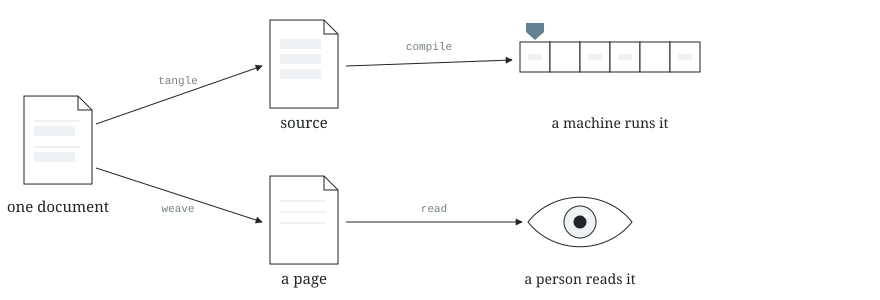
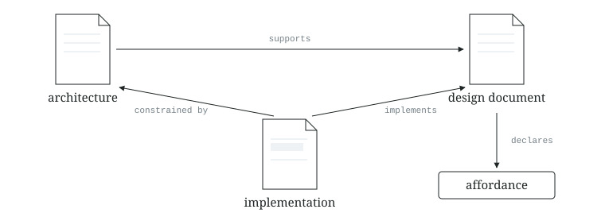
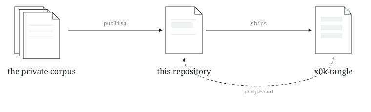

<!-- @generated by x0k-tangle (pipeline: identity-tangle) from corpora/x0k/publications/x0k-folio/x0k-folio.md — DO NOT EDIT. -->
<picture>
  <source media="(prefers-color-scheme: dark)" srcset="assets/diagrams/plate-dark.svg">
  
</picture>

Folio turns a folder of Markdown into a typed, checked graph: documents
declare what they are and how they relate, own or quote code, and can be
queried and published as a set.

Where to start depends on what your documents already are:

- **Decision records, design docs, an ADR directory.** Give each one a header
  and let [`check`](#typed-documents) fail CI when a header names a document
  that is not there, such as after an unfinished rename; `query` lists what is
  current and what replaced what.
- **Docs that quote code.** [Mirror](#quote-code-you-already-have) the quoted
  symbols, so a page that quotes a function fails CI when the function
  changes. Your code stays where it is.
- **Code whose explanation matters as much as the code.** Let the document
  [own it](#a-document-that-owns-its-code): its code blocks are the source, and
  the files are generated from them.

## A document that owns its code

Here is a whole document, `docs/occlusion.md`:

````markdown
---
x0k:
  format: folio/v1
  id: x0k:implementation/occlusion
  type: implementation
  status: accepted
  tangle:
    root: src/occlusion.js
---
# Ambient occlusion

The visibility term is the mean of the samples the sampler returned.

```js {#average}
export function occlusion(samples) {
  return samples.reduce((a, b) => a + b, 0) / samples.length;
}
```

The type declarations are written here too, beside the function they
describe, and land in a file of their own:

```ts {#types file="src/occlusion.d.ts"}
export declare function occlusion(samples: number[]): number;
```
````

Then, with the tools [installed](#install):

```sh
x0k-tangle tangle docs/occlusion.md --workspace .
```

**Tangling** is that step — collecting a document's code blocks into source
files. It writes `src/occlusion.js` and `src/occlusion.d.ts`, each opening
with a `@generated` header in that file's own comment style, plus a
`docs/occlusion.tangle-map.json` sidecar recording which chunk produced which
file.

One document, two files, two languages. The declarations and the code they
declare cannot fall out of step, because there is one place to edit them and
the other file is output. Nothing about it is specific to TypeScript, and
nothing about it is specific to Rust either — the tools are Rust, the
documents are whatever you write.

Chunks also splice: a line reading `<<average>>` inside another block pastes
the `average` block in there, at the reference's own indentation. So you choose
the order that explains the program, and the compiler still receives the order
it needs.

**Weaving** is the other direction — the same document rendered as a page to
read, each chunk reference a link to its definition:
`x0k-tangle weave docs/occlusion.md --output-dir site`.

<picture>
  <source media="(prefers-color-scheme: dark)" srcset="assets/diagrams/derive-dark.svg">
  
</picture>

Commit the document, the sidecar and the generated files together, and have CI
re-tangle and fail if the tree changes. That check is the whole reason the
prose stays true to the code; without it you have comments again.

## Quote code you already have

A document can quote code it does not own. Name the file and the symbol, and
leave the block empty:

````markdown
The budget refills on every successful call:

```rust {#refill from="src/budget.rs" symbol="Budget::refill"}
```
````

From the project root, `x0k-tangle sync docs` fills the block from the source,
and `x0k-tangle check docs` fails once the two differ, so a page cannot go on
showing code the tree no longer has. A mirror needs no header: it works in any
Markdown file. Symbols resolve in
Rust, TypeScript, JavaScript and TSX, Python, and Julia, and a mirror copies
the whole item it names. [Starting from code you already have](guides/INTEGRATING.md#starting-from-code-you-already-have)
covers methods, decorated items and the other path forms.

## Install

```sh
curl -fsSL https://0k.computer/folio/install.sh | sh
```

This installs `x0k-tangle` and `x0k-folio-cli` for Linux or macOS (x86_64 or
arm64) from [the latest release](https://github.com/0k-dot-computer/x0k-folio/releases),
checking each archive against the release's `SHA256SUMS` before anything is
written. The address is this project's own domain and redirects to the
release's `install.sh`; to do the same by hand, download your platform's
archive and `SHA256SUMS` from the release page and run `shasum -a 256 -c`.
On Windows, take the `.zip` from the release page. With a Rust toolchain,
`cargo install x0k-tangle` builds the tangler from crates.io instead.
[Setup](guides/INTEGRATING.md#setup) covers pinning a version, verifying build
provenance, and building from source.

## Typed documents

Each document has a small YAML header that gives it an identity, a kind, and
named relationships to other documents. An implementation can name the design
it follows; a design can name the decision that supports it; a decision can
name the one that replaced it:

```yaml
---
x0k:
  format: folio/v1
  id: acme:decision/retry-budget
  type: decision
  status: superseded
  edges:
    superseded_by:
      - acme:decision/retry-budget-v2
---
```

`check` validates headers against the shipped vocabulary, or yours:
`--vocabulary <dir>` adds your own modules, and
[a six-line module](guides/INTEGRATING.md#the-smallest-module-of-all) gives
your documents their own id prefix, like `acme:` here. What a typed
collection gives you, and the command behind each:

| What | Command | Fails when |
|---|---|---|
| Check headers and links against the vocabulary | `x0k-tangle check <dir>` | a type or edge the vocabulary does not declare; in a class it describes, an undeclared field or a literal its datatype contradicts |
| Gate CI on a closed set | `x0k-tangle check <dir> --closed` | an edge names a document that is not in the set, such as a rename nobody finished |
| Keep generated code in step | `x0k-tangle tangle <doc>`, then `git diff --exit-code` | a generated file no longer matches its document |
| Keep quoted code current | `x0k-tangle sync <path…>`, then `check` | a mirror no longer matches the source it quotes |
| Ask across the set | `x0k-folio-cli ingest`, then `query --named status` or `--named superseded` | — (lists every document's status, or each replaced decision and what replaced it, read from `superseded_by` edges) |

Out of the box an edge to a document outside the scanned folder is a note,
not a failure, because a collection is usually part of something larger;
`--closed` is for the tree that is the whole set. The guide covers each row:
[typing documents](guides/INTEGRATING.md#typing-your-documents-in-place),
[quoting code you already have](guides/INTEGRATING.md#starting-from-code-you-already-have),
[asking questions](guides/INTEGRATING.md#asking-the-collection-a-question).

<picture>
  <source media="(prefers-color-scheme: dark)" srcset="assets/diagrams/triangle-dark.svg">
  
</picture>

## Try it

With the tools installed, write the document above and run the tangle
command under it, or [add a header to one document you already have](guides/INTEGRATING.md#typing-your-documents-in-place)
and check the folder it is in:

```sh
x0k-tangle check docs
```

A file with no header is left out of the header checks and counted — its
mirrors and chunks are still checked — so a folder can adopt one document at
a time.

If you evaluate tools with an agent, this prompt starts it in the right
places:

```
Read https://github.com/0k-dot-computer/x0k-folio, starting with README.md and
guides/INTEGRATING.md. Look at my project. Where would typed documents or code
generated from documents be useful? Name a specific place to start, show
a small example, and explain the cost of keeping it up to date.
```

## Status

- **Releases:** [GitHub releases](https://github.com/0k-dot-computer/x0k-folio/releases),
  each with platform binaries, `SHA256SUMS`, build provenance and a source
  tarball that rebuilds offline; what changed is in [`CHANGELOG.md`](CHANGELOG.md).
- **crates.io:** `x0k-tangle` and the library crates it builds on.
  `x0k-folio-cli` is not on crates.io, because its storage adapter depends on
  [Dialog](https://github.com/dialog-db/dialog-db) by git revision; it ships
  in the release binaries and installs with `cargo install --git`.
- **Platforms:** the install script covers Linux and macOS on x86_64 and arm64;
  Windows has a release `.zip`. Building from source needs Rust 1.89 or later
  and a C compiler, for the tree-sitter grammars.
- **Stability:** before 1.0, a minor version may change the library crates'
  APIs; the changelog names each such change.
- **Contributing:** issues and pull requests go to this repository. Most files
  here are generated from Markdown sources that are edited upstream, so a
  change to one of them is applied there and returns with the next release;
  [`guides/CONTRIBUTING.md`](guides/CONTRIBUTING.md) says which files are
  edited here directly.
- **Not done yet:** [what these tools do not do yet](guides/INTEGRATING.md#what-does-not-exist-yet).

## What you can do with this

- <picture><source media="(prefers-color-scheme: dark)" srcset="assets/icons/tangle-source-from-a-document-dark.svg"></picture> **[Project source code out of a document](decisions/design/corpus/literate-programming/project-source-code-out-of-a-document.md)**

  <p>Collect a document's code blocks into source files a compiler can build.</p>

- <picture><source media="(prefers-color-scheme: dark)" srcset="assets/icons/weave-a-document-dark.svg"></picture> **[Read a document as the woven artifact](decisions/design/corpus/literate-programming/read-a-document-as-the-woven-artifact.md)**

  <p>Read the explanation and code together, with each reference to another code block a link to where that block is defined.</p>

- <picture><source media="(prefers-color-scheme: dark)" srcset="assets/icons/check-a-document-against-shipped-vocabulary-dark.svg"></picture> **[Check a document against its vocabulary](decisions/design/corpus/publish-a-region-as-a-repository/check-a-document-against-its-vocabulary.md)**

  <p>Find metadata and relationships that do not match the document vocabulary.</p>

- <picture><source media="(prefers-color-scheme: dark)" srcset="assets/icons/read-declared-affordances-dark.svg"></picture> **[Declare concepts and instances](decisions/design/corpus/publish-a-region-as-a-repository/declare-concepts-and-instances.md)**

  <p>Define a vocabulary in a document, then describe particular things with it.</p>

- <picture><source media="(prefers-color-scheme: dark)" srcset="assets/icons/query-the-documents-dark.svg"></picture> **[Query the documents](decisions/design/corpus/publish-a-region-as-a-repository/query-the-documents.md)**

  <p>Ask questions across a collection's concepts, instances, and relationships.</p>

- <picture><source media="(prefers-color-scheme: dark)" srcset="assets/icons/show-an-icon-on-a-surface-dark.svg"></picture> **[Show an icon on any surface](decisions/design/presentation/icon-profile/show-an-icon-on-any-surface.md)**

  <p>Draw the same icon for different surfaces, using the colors and file format each needs.</p>

- <picture><source media="(prefers-color-scheme: dark)" srcset="assets/icons/check-an-icon-against-the-profile-dark.svg"></picture> **[Check an icon against the profile](decisions/design/presentation/icon-profile/check-an-icon-against-the-profile.md)**

  <p>Check an icon's geometry and strokes against the shared drawing rules.</p>

## Vocabularies and publications

The vocabulary is RDF. Its concepts are OWL classes, and a document can define
concepts of its own in a `turtle folio:ontology` block and describe particular
things with them in typed blocks.
[`crates/x0k-folio-cli/examples/papers/`](crates/x0k-folio-cli/examples/papers)
is a small collection that does both — a `paper:` namespace and a `Paper`
class, and two papers citing each other — to copy as a start.
[Explore the supplied vocabulary](assets/diagrams/vocabulary.svg).

A **publication** selects documents and code from a larger collection and
produces a standalone repository, recording their origins in
`PROVENANCE.json`. This repository is one: it carries the tool that produced
it, with that tool's source documents in `implementation/` generating the
code in `crates/`.

<picture>
  <source media="(prefers-color-scheme: dark)" srcset="assets/diagrams/circle-dark.svg">
  
</picture>

## License

MIT ([`LICENSE-MIT`](LICENSE-MIT)). Dependencies keep their own terms,
listed with the [implementation map](IMPLEMENTATION.md#license).

[Implementation](IMPLEMENTATION.md) · [Integration](guides/INTEGRATING.md) ·
[Contributing](guides/CONTRIBUTING.md) · [Background and prior work](IMPLEMENTATION.md#lineage) ·
[MIT license](LICENSE-MIT)
